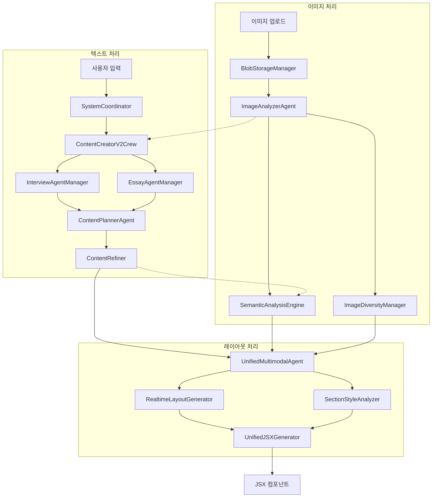
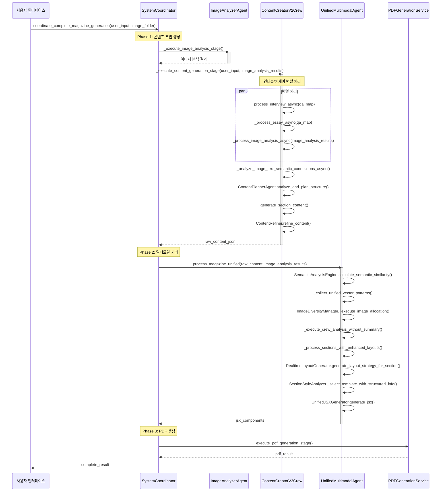
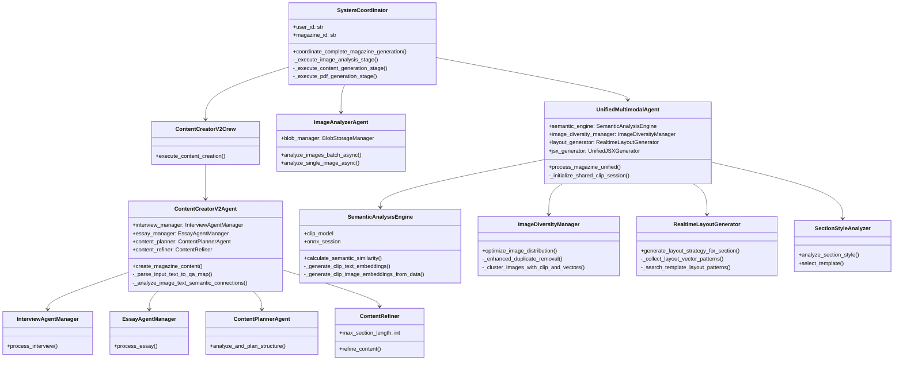
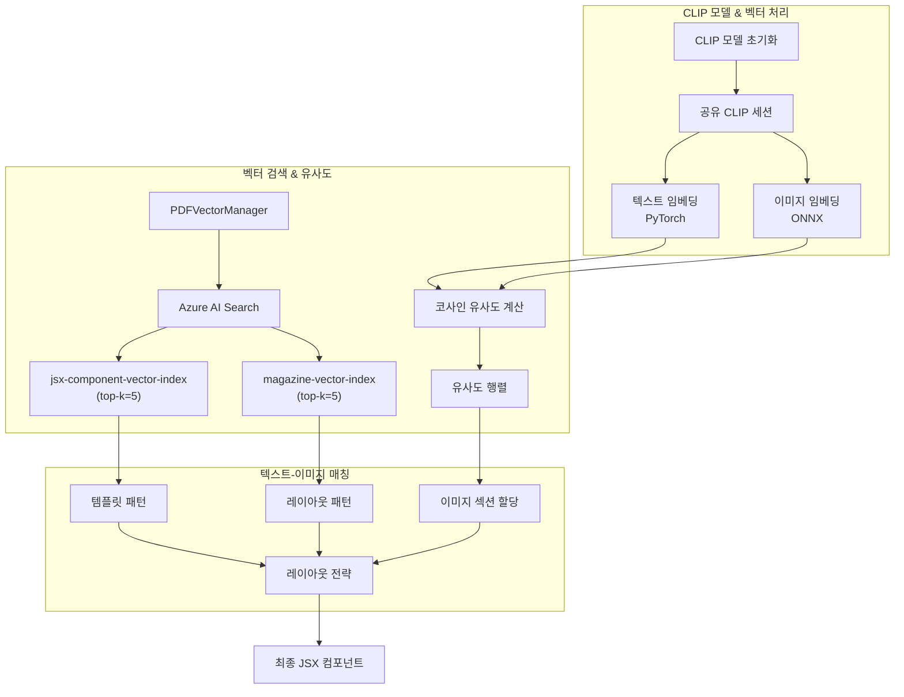

# 🔍 프로젝트 개요

이 프로젝트는 대규모 멀티모달 LLM 파이프라인으로 사용자 입력 텍스트와 이미지를 처리하여 매거진 형태의 콘텐츠를 생성합니다. FastAPI 기반의 백엔드 시스템은 CrewAI 워크플로를 활용해 여러 전문 에이전트가 협업하는 구조를 채택했습니다. 텍스트 처리(인터뷰/에세이), 이미지 분석(CLIP 모델 기반), 의미적 연결, 레이아웃 최적화 단계를 거쳐 최종 JSX 컴포넌트로 출력합니다. Azure AI Search 벡터 인덱스와 ONNX 런타임을 활용한 효율적 이미지 처리가 특징입니다.

# 📂 폴더 맵

| 경로                                                      | 설명                                              |
| --------------------------------------------------------- | ------------------------------------------------- |
| `/main.py`                                                | 애플리케이션 진입점, FastAPI 서버 설정 및 초기화  |
| `/backend/app/agents/`                                    | 핵심 에이전트 모듈 디렉터리                       |
| `/backend/app/agents/system_coordinator.py`               | 전체 시스템 조율 및 워크플로 관리                 |
| `/backend/app/agents/image_analyzer.py`                   | 이미지 지리적 위치 및 특성 분석                   |
| `/backend/app/agents/contents/`                           | 콘텐츠 생성 관련 에이전트 모듈                    |
| `/backend/app/agents/contents/content_creator.py`         | 콘텐츠 생성 통합 오케스트레이터                   |
| `/backend/app/agents/contents/interview_agent.py`         | 인터뷰 형식 변환 전문 에이전트                    |
| `/backend/app/agents/contents/essay_agent.py`             | 에세이 형식 변환 전문 에이전트                    |
| `/backend/app/agents/contents/content_planner.py`         | 콘텐츠 구조 설계 에이전트                         |
| `/backend/app/agents/contents/content_refiner.py`         | 콘텐츠 분량 검사 및 지능적 분할                   |
| `/backend/app/agents/Editor/`                             | 레이아웃 및 시각적 최적화 모듈                    |
| `/backend/app/agents/Editor/unified_multimodal_agent.py`  | 통합 멀티모달 처리 에이전트                       |
| `/backend/app/agents/Editor/semantic_analysis_engine.py`  | CLIP 기반 텍스트-이미지 의미 유사도 계산          |
| `/backend/app/agents/Editor/image_diversity_manager.py`   | 이미지 중복 제거 및 다양성 최적화                 |
| `/backend/app/agents/Editor/realtime_layout_generator.py` | AI Search 기반 레이아웃 전략 수립                 |
| `/backend/app/agents/jsx/`                                | JSX 템플릿 및 생성 관련 모듈                      |
| `/backend/app/custom_llm.py`                              | Azure OpenAI 서비스 통합 LLM 인터페이스           |
| `/backend/app/utils/data/`                                | 데이터 처리 유틸리티 (Blob Storage, 벡터 검색 등) |
| `/backend/app/utils/isolation/`                           | 모듈 간 격리 및 세션 관리                         |
| `/backend/app/db/`                                        | 데이터베이스 연결 및 관리 (CosmosDB)              |
| `/backend/app/model/clip_onnx/`                           | ONNX 변환 CLIP 모델 파일                          |

# 🧩 컴포넌트 분석

## ContentCreatorV2Agent (파이프라인 오케스트레이터)

- **책임(SR)**: 인터뷰와 에세이 에이전트를 통합하여 매거진 콘텐츠 생성 조율
- **주요 메서드**:
  - `_parse_input_text_to_qa_map()`: 사용자 텍스트를 Q&A 형식으로 파싱
  - `create_magazine_content()`: 텍스트와 이미지 분석 결과로 매거진 콘텐츠 생성
  - `_analyze_image_text_semantic_connections()`: 이미지-텍스트 의미적 연결 분석
- **데이터 흐름**:
  - 입력: 사용자 질문-응답 텍스트, 이미지 분석 결과
  - 출력: 구조화된 매거진 콘텐츠 JSON
- **CrewAI 패턴**: CrewAI Agent 생성 후 Task 실행 방식 사용
- **성능 튜닝**: 인터뷰/에세이 생성을 병렬 처리하여 응답 시간 최적화

## InterviewAgentManager

- **책임(SR)**: Q&A 데이터를 자연스러운 인터뷰 형식으로 변환
- **주요 메서드**: `process_interview()`, `generate_interview_from_qa()`
- **외부 의존성**: Azure OpenAI 서비스, CrewAI
- **예외 처리**: 시스템 프롬프트 실패 시 대체 프롬프트 사용
- **데이터 스키마**:
  - 입력: Q&A 맵(Dict[str, str])
  - 출력: 인터뷰 형식 텍스트(Dict[str, str])

## EssayAgentManager

- **책임(SR)**: Q&A 데이터를 일관된 에세이 형식으로 변환
- **주요 메서드**: `process_essay()`, `generate_essay_from_qa()`
- **외부 의존성**: Azure OpenAI 서비스, CrewAI
- **예외 처리**: 길이 제한 초과 시 자동 분할 처리
- **데이터 스키마**:
  - 입력: Q&A 맵(Dict[str, str])
  - 출력: 에세이 섹션별 텍스트(Dict[str, str])

## ContentPlannerAgent

- **책임(SR)**: 인터뷰와 에세이 데이터로 콘텐츠 구조와 섹션 설계
- **주요 메서드**: `analyze_and_plan_structure()`
- **데이터 스키마**:
  - 입력: 인터뷰 결과, 에세이 결과, 이미지 분석
  - 출력: 섹션별 구조 계획(Dict)
- **성능 튜닝**: 이미지 특성을 고려한 섹션 분할로 시각적 효과 극대화

## ContentRefiner

- **책임(SR)**: 섹션별 콘텐츠 분량 검사와 지능적 분할
- **주요 메서드**: `refine_content()`, `_check_section_length()`
- **외부 의존성**: Azure OpenAI 서비스
- **데이터 스키마**:
  - 입력: 섹션 리스트(List[Dict])
  - 출력: 최적화된 섹션 리스트(List[Dict])
- **성능 튜닝**: 최대 섹션 길이(max_section_length) 조정으로 균형 조절

## ImageDiversityManager

- **책임(SR)**: 이미지 중복 제거와 다양성 최적화
- **주요 메서드**:
  - `optimize_image_distribution()`: 섹션별 이미지 배치 최적화
  - `_enhanced_duplicate_removal()`: 강화된 중복 이미지 제거
  - `_cluster_images_with_clip_and_vectors()`: CLIP 기반 이미지 클러스터링
- **외부 의존성**: ONNX Runtime, CLIP 모델, Blob Storage
- **데이터 스키마**:
  - 입력: 이미지 리스트(List[Dict]), 섹션 리스트(List[Dict])
  - 출력: 섹션별 이미지 할당 계획(Dict)
- **성능 튜닝**: 공유 CLIP 세션 사용으로 메모리 효율화

## SemanticAnalysisEngine

- **책임(SR)**: CLIP 모델로 텍스트-이미지 의미적 유사도 계산
- **주요 메서드**:
  - `calculate_semantic_similarity()`: 텍스트-이미지 코사인 유사도 행렬 계산
  - `_generate_clip_text_embeddings()`: 텍스트 임베딩 생성
  - `_generate_clip_image_embeddings_from_data()`: 이미지 임베딩 생성
- **외부 의존성**: OpenCLIP, ONNX Runtime, PyTorch
- **데이터 스키마**:
  - 입력: 텍스트 리스트(List[str]), 이미지 리스트(List[Dict])
  - 출력: 유사도 행렬과 임베딩(Dict)
- **성능 튜닝**: PyTorch(텍스트)와 ONNX(이미지) 분리로 최적화

## RealtimeLayoutGenerator

- **책임(SR)**: AI Search 패턴 기반 레이아웃 전략 생성
- **주요 메서드**:
  - `generate_layout_strategy_for_section()`: 섹션별 레이아웃 전략 생성
  - `_collect_layout_vector_patterns()`: AI Search 벡터 패턴 수집
- **외부 의존성**: Azure AI Search, PDFVectorManager
- **데이터 스키마**:
  - 입력: 섹션 데이터(Dict)
  - 출력: 레이아웃 전략(Dict)
- **성능 튜닝**: 패턴 캐싱으로 중복 검색 최소화

## UnifiedMultimodalAgent

- **책임(SR)**: 콘텐츠 구조화, 이미지 배치, JSX 생성 통합 조정
- **주요 메서드**:
  - `process_magazine_unified()`: 통합 멀티모달 매거진 처리
  - `_execute_image_allocation()`: 이미지 섹션별 할당
  - `_process_sections_with_enhanced_layouts()`: 향상된 레이아웃으로 섹션 처리
- **외부 의존성**: CrewAI, CLIP, PDFVectorManager
- **데이터 스키마**:
  - 입력: 매거진 콘텐츠(Dict), 이미지 분석 결과(List[Dict])
  - 출력: JSX 컴포넌트 포함 최종 결과(Dict)
- **성능 튜닝**: 공유 CLIP 세션 활용으로 메모리 사용량 감소

## SectionStyleAnalyzer/TemplateSelector

- **책임(SR)**: 섹션 내용에 적합한 JSX 템플릿 선택
- **주요 메서드**: `select_template()`, `analyze_section_style()`
- **외부 의존성**: Azure AI Search
- **데이터 스키마**:
  - 입력: 섹션 데이터(Dict), 구조화 정보(Dict)
  - 출력: 선택된 템플릿 코드(str)
- **성능 튜닝**: 벡터 검색 기반 템플릿 유사도 계산으로 매칭 속도 향상

# 🗺️ Mermaid 다이어그램

## 고수준 아키텍처 다이어그램

## 주요 비동기 시퀀스 다이어그램

## 주요 컴포넌트 클래스 다이어그램

## 벡터 데이터 흐름 다이어그램

# 💡 인사이트·제안

1. **메모리 최적화**: CLIP 모델의 세션 공유 패턴(UnifiedMultimodalAgent에서 초기화하여 SemanticAnalysisEngine과 ImageDiversityManager에 주입)이 메모리 사용량을 크게 줄였습니다. 이 패턴을 다른 무거운 모델에도 확장 적용할 수 있습니다.

2. **병목 개선**: 이미지 처리가 주요 병목점입니다. 이미지 임베딩 캐싱 시스템을 도입하여 이미 처리된 이미지를 재활용하고 동일한 벡터 검색 쿼리 결과도 캐싱하면 성능이 크게 향상될 것입니다.

3. **아키텍처 단순화**: ContentCreatorV2Agent와 ContentCreatorV2Crew 간 책임이 불명확합니다. 단일 클래스로 통합하고 CrewAI 활용 패턴을 일관되게 적용해야 합니다.

4. **예외 처리 강화**: 이미지 분석이 실패해도 텍스트 기반 콘텐츠 생성이 계속되는 폴백 메커니즘은 좋지만, 더 세분화된 단계별 예외 처리와 복구 전략이 필요합니다.

5. **벡터 검색 최적화**: Azure AI Search 쿼리가 너무 일반적입니다. 특히 RealtimeLayoutGenerator에서 template_query와 placement_query를 더 구체적이고 컨텍스트 기반으로 구성하여 관련성을 높여야 합니다.

6. **CLIP 최적화**: 텍스트는 PyTorch, 이미지는 ONNX로 분리한 패턴은 효율적이지만, 전체 모델을 ONNX로 통합하고 양자화하면 추가 성능 향상이 가능합니다.

7. **이미지 다양성 향상**: ImageDiversityManager의 이미지 클러스터링이 효과적이지만, 감정적 톤과 시각적 스타일도 고려하여 다양성 지표를 확장해야 합니다.

8. **테스트 전략**: 현재 테스트 코드가 부족합니다. 각 에이전트에 대한 단위 테스트와 전체 파이프라인에 대한 통합 테스트를 구현하고, 특히 CLIP 기반 유사도 계산과 이미지 할당 로직에 대한 검증이 필요합니다.

9. **확장성 개선**: CosmosDB와 Azure Storage를 활용한 현재 구조는 확장 가능하지만, 대규모 처리를 위한 작업 큐(예: Azure Service Bus)와 비동기 처리 패턴을 추가하면 더 좋을 것입니다.

10. **코드 표준화**: 일부 모듈(특히 content_creator.py)이 지나치게 길고 복잡합니다. 책임을 더 작은 클래스로 분리하고 일관된 에러 처리 패턴을 적용해야 합니다.

11. **프로파일링 도입**: 멀티모달 처리 전체 파이프라인에 대한 성능 프로파일링 도구를 통합하여 병목점을 정확히 식별하고 최적화 우선순위를 결정해야 합니다.

12. **배포 자동화**: 현재 Docker 기반 배포는 좋지만, CI/CD 파이프라인을 구축하여 테스트 자동화와 점진적 배포를 구현할 것을 제안합니다.
